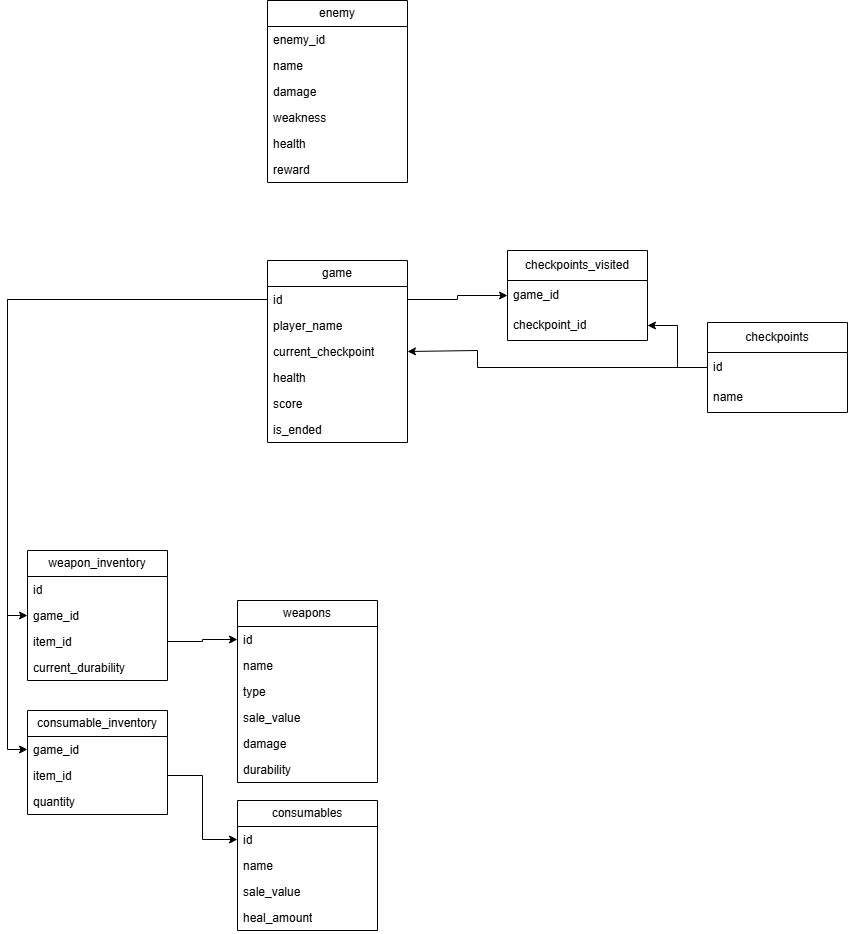

# Lonely Scout Game

Tervetuloa **Lonely Scout** -pelin dokumentaatioon! Tämä tiedosto sisältää kaiken tarvittavan pelin ymmärtämiseen, asentamiseen ja pelaamiseen.
Peli on tehty Pythonilla hyödyntäen MariaDB tietokantaintegraatiota. Peli pyrkii jäljittelemään
klassisen lautapelin tunnelmaa ja vuoropohjaista rakennetta.

#### 🎮 Selviytymis- ja tiedustelupeli 🎮

---

## 📖 Pelin Tarina

Olet tiedustelija joka etsii omalta asuin saareltaan resursseja. Taistelet aikaa vastaan koska saarellesi on tulossa hyökkäys
viholliset rantautuvat saarellesi 10 päivän kuluttua ja tehtävänäsi on selvitä
takaisin kotiin käyttämällä löytämiäsi resursseja, peli päättyy jos kohtaat
vihollisen ja häviät taistelun tai selviät takaisin kotiisi ja saat kuljetettua löytämäsi aarteet turvallisesti kotiisi.

---

## 🖥️ Järjestelmävaatimukset

### Laitteisto:
  * Prosesori: 1Ghz
  * RAM: 2GB
  * Tallennustila väh. 100MB vapaata tilaa
  * Integroitu näytönohjain tai erillinen.
  * Windows 11 / Linux (Ubuntu, Fedora, Debian)

---

## ⚙️ Pelin Asetukset
* Ikkunanresoluutio: 1920x1080
* Ohjaimeksi Tietokoneen hiiri riittää.

---

## 📊 Tietokantaintegraatio (MariaDB)

---

## 👏 CREDITS

- **Pelin kehittäjät:** Mico Schalin (producer), Olga Shomarova, Pauli Linnakangas

---

## 🔗 Hyödyllisiä Linkkejä

- [Markdown Cheat Sheet](https://webdevsimplified.com/markdown-cheat-sheet.html)
- [Erdplus](https://erdplus.com)
