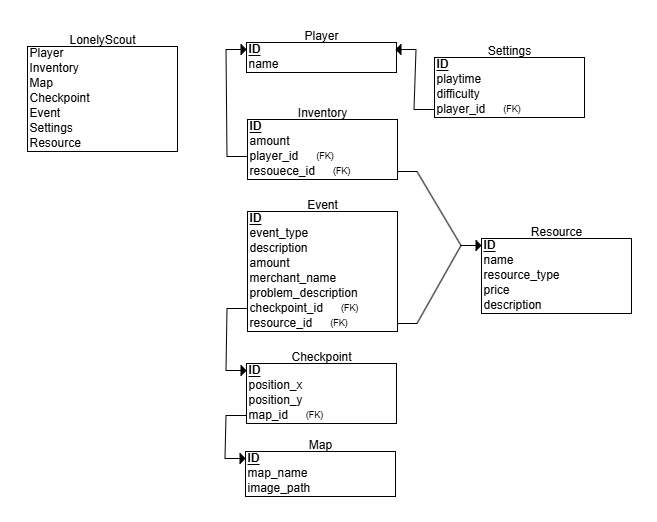

# Lonely Scout Game

Tervetuloa **Lonely Scout** -pelin dokumentaatioon! Tämä tiedosto sisältää kaiken tarvittavan pelin ymmärtämiseen, asentamiseen ja pelaamiseen.
Peli on tehty Pythonilla hyödyntäen MariaDB tietokantaintegraatiota. Peli pyrkii jäljittelemään
klassisen lautapelin tunnelmaa ja vuoropohjaista rakennetta.

#### 🎮 Selviytymis- ja tiedustelupeli 🎮

---

## 📖 Pelin Tarina

Olet tiedustelija joka etsii omalta asuin saareltaan resursseja. Taistelet aikaa vastaan koska saarellesi on tulossa hyökkäys
viholliset rantautuvat saarellesi 10 päivän kuluttua ja tehtävänäsi on selvitä
takaisin kotiin käyttämällä löytämiäsi resursseja, peli päättyy jos kohtaat
vihollisen ja häviät taistelun tai selviät takaisin kotiisi ja saat kuljetettua löytämäsi aarteet turvallisesti kotiisi.

---

## 🖥️ Järjestelmävaatimukset

### Laitteisto:
  * Prosesori: 1Ghz
  * RAM: 2GB
  * Tallennustila väh. 100MB vapaata tilaa
  * Integroitu näytönohjain tai erillinen.
  * Windows 11 / Linux (Ubuntu, Fedora, Debian)

---

## 🎮 Pelimekaniikat

Pelaaja aloittaa "kotipaikaltaan" pelin kartalla tämä toimii myös pelin lopun paikkana.
Pelaaja voi liikkua kentällä viereisiin "checkpointeihin" heittämällä noppaa joka laskee liikkumisen hintaa.
Hinta lasketaan aikana ja vähennetään ajasta kunnes viholliset saapuvat saarelle.

Kun aika
on käytetty ja viholliset saapuvat pelaaja voi liikkua vapaasti ilman ajan miettimistä mutta
pelaajalla on nyt vastassaan enenmän vihollisia ja takaisin pääsystä kotiin tulee paljon vaikeampaa.
Jos pelaaja kohtaa vihollisen eikä pysty puolustautumaan vihollista vastaan, peli loppuu ja pelaaja menettää
koko saaliin eikä saa "scorea" pelin päättyessä.

Jos pelaaja selviää kotiinsa
pelaajan "score" lasketaan pelaajan keräämistä resursseista ja ilmoitetaan pelaajalle saatu tulos ja
verrataan sitä tietokannassa olevaan edelliseen scoreen, jos se on isompi tallenetaan se uudeksi "High Scoreksi".

---

## 🌍 Pelin Maailma

Pelin maailma on luotu Githubissa olevalla [Azgaar Fantasy Map Generaattorilla.](https://azgaar.github.io/Fantasy-Map-Generator/)

Pelin muu grafiikka on tehty pikseli grafiikkatyökalulla nimeltä [Aseprite.](https://www.aseprite.org/)

---

## ⚙️ Pelin Asetukset
* Ikkunanresoluutio: 1920x1080
* Ohjaimeksi Tietokoneen hiiri riittää.

---

## 📊 Tietokantaintegraatio (MariaDB)

---

## 👏 CREDITS

- **Pelin kehittäjät:** Mico Schalin (producer), Olga Shomarova, Pauli Linnakangas
- **Käytetyt ulkoiset kirjastot ja työkalut:** .Sys, .random, Erdplus

---

## 🔗 Hyödyllisiä Linkkejä

- [Markdown Cheat Sheet](https://webdevsimplified.com/markdown-cheat-sheet.html)
- [Erdplus](https://erdplus.com)
